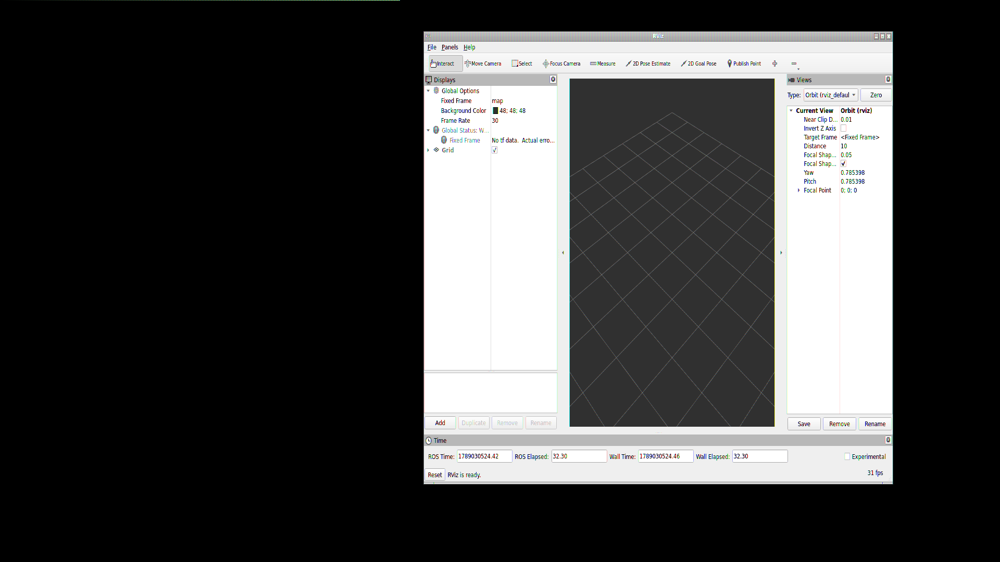
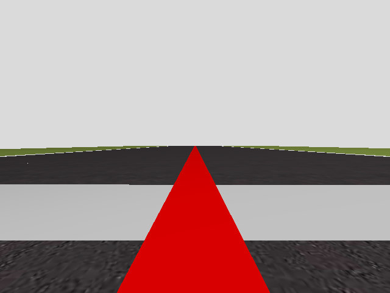

# Weekly Update - Week 10

## Overview
During **Week 10**, we focused on completing local testing and development without requiring remote server infrastructure. We performed in-depth 3D GUI rendering and VNC benchmarking on macOS Apple Silicon Docker, validated the FollowLine onboard camera pipeline in headless simulation, and expanded the **ROS 2 Nav2** integration to the **Amazon Warehouse** challenge.

---

## Tasks Completed

### 1. 3D GUI Rendering & VNC Benchmarking on macOS Docker (Tasks T31, T32, T33)
To evaluate graphical rendering on macOS Apple Silicon (M-series ARM architecture with Rosetta 2 x86_64 emulation), we set up isolated testing environments outside the RoboticsAcademy web application.

```
+-------------------------------------------------------------------------------+
|                             TASK T33 TEST RESULTS                             |
+---------------------+-------------------------+---------------+---------------+
| Application Tested  | Rendering Pipeline      | Status        | Framerate     |
+---------------------+-------------------------+---------------+---------------+
| OpenGL Diagnostics  | Mesa llvmpipe (SW)      | PASSED        | N/A           |
| RViz2 (ROS 2 GUI)   | OGRE 1 / Standard GL    | PASSED        | 31 FPS        |
| Gazebo Harmonic GUI | QtQuick / QML GL Shaders| FAILED (Black)| 0 FPS (Blank) |
+---------------------+-------------------------+---------------+---------------+
```

* **Task T33 - RViz2 3D OpenGL Test (PASSED):** Standard OpenGL applications like RViz2 ran interactively at **31 FPS** over VNC under software rasterization (`llvmpipe`).

<p align="center">
  
</p>

* **Task T33 - Gazebo GUI Viewport Test (FAILED - Black Viewport):** Gazebo started its UI shell and menus, but the 3D scene viewport remained black due to QtQuick/QML shader compositing limitations under Rosetta 2 software OpenGL.

<p align="center">
  
</p>

* **Task T31 - Headless Gazebo Simulation & Camera Streaming (PASSED):** Verified that headless Gazebo simulation (`gz sim -s`) generates sensor frames reliably on macOS. Subscribed directly to `/cam_f1_left/image_raw` ($640 \times 480$ RGB) and fixed WebGUI WebSocket throughput in `MeasuringThreadingGUI`.

<p align="center">
  
</p>

* **Task T32 - Standalone Gazebo Jetty / ROS 2 Jazzy Container:** Built an isolated Docker image `task32_gazebo_jetty:latest` on Ubuntu 24.04 Noble to evaluate upstream Gazebo Harmonic/Jetty rendering.

---

### 2. Nav2 Navigation Stack Integration (Tasks T1 & T2)

* **Task T1 - Global Navigation Integration:** Configured headless Gazebo simulation (`global_navigation_nav2.launch.py`), static transforms (`map -> odom`), map server lifecycle management, and `nav2_bridge.py` for WebGUI integration.
* **Task T2 - Amazon Warehouse Nav2 Integration:** Tuned custom parameters (`nav2_params.yaml`) with rolling local costmap ($6\text{ m} \times 6\text{ m}$ at $0.05\text{ m}$ resolution), laser scan obstacle layer (`/amazon_robot/scan`), and Kiva AGV footprint ($0.45\text{ m}$ radius). Built `amazon_warehouse_nav2.launch.py` and `nav2_warehouse_bridge.py`.

---

## Key Conclusions for macOS Architecture

1. **Decoupled Workflow:** On macOS Apple Silicon, running Gazebo headlessly (`gz sim -s`) coupled with ROS 2 topic visualization (RViz2 or WebGUI canvas widgets) is the stable, high-performance approach.
2. **Nav2 Compatibility:** Both City Navigation and Amazon Warehouse exercises operate successfully on standard Nav2 launch descriptions.
